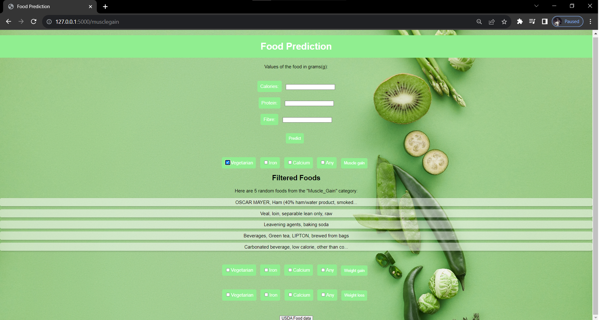

# Diet Recommendation System

## Overview
The Diet Recommendation System is a web-based application built with Flask, aimed at providing dietary recommendations based on user-specific macro-nutrient requirements. It includes a pre-trained machine learning model for making personalized food recommendations, helping users achieve their health and fitness goals.

## Sample Screenshots

## Features
- Predicts diet recommendations for users based on their input data.
- Offers recommendations for muscle gain, weight gain, weight loss, and general diets.
- Provides filters for dietary preferences such as vegetarian and specific nutrient requirements.
- Presents results with detailed food descriptions.

## Installation
To run this project, follow these steps:

1. Clone the repository to your local machine.
2. Install the required dependencies using `pip install -r requirements.txt`.
3. Make sure you have Python and Flask installed on your system.
4. Run the Flask application using `python app.py`.

## Usage
1. Access the web application by navigating to [http://localhost:5000/](http://localhost:5000/) in your web browser.
2. Input your dietary preferences and specific nutrient requirements.
3. Click the "Predict" button to get diet recommendations tailored to your needs.
4. Explore muscle gain, weight gain, and weight loss diets through the respective buttons.
5. Customize your diet recommendations by filtering based on your dietary preferences and nutrient needs.

## Data Sources
The project uses food data stored in a CSV file named `done_food_data.csv`. This data is employed for diet recommendations and descriptions.

## Models
- The project utilizes a pre-trained machine learning model stored in `food_model.pickle` for making diet predictions.

## Contributing
We welcome contributions to enhance this diet recommendation system. Please follow the guidelines in the [CONTRIBUTING.md](CONTRIBUTING.md) file to get started.

